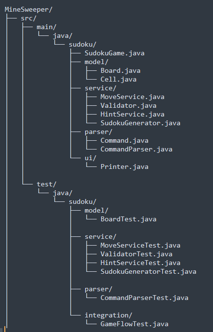

# Sudoku Console Game (Java)

A command-line Sudoku game built in Java with clean OOP design, validation logic, and JUnit testing.

---

# Features

- Play Sudoku in terminal
- Insert numbers (e.g., `A3 5`)
- Clear cells (`C5 clear`)
- Get hint (`hint`)
- Validate board (`check`)
- Auto-detect win condition

---

# Architecture

---

# How to Run

## Build project

mvn clean install

## Run game (Eclipse)

Run SudokuGame.java as Java Application

---

# Run Tests

## All tests

mvn test

## Eclipse
- Right click project → Run As → mvn test  
OR  
- Right click test → Run As → JUnit Test

---

#  Rules

- No duplicates in row, column, or 3×3 grid
- Pre-filled cells cannot be modified
- Game ends when board is fully and correctly filled

---

#  Design Highlights

- Clean separation of responsibilities (SRP)
- Validator isolated from Move logic
- Hint system is read-only
- Fully unit tested with JUnit 5

---

#  Requirements

- Java 11+
- Maven 3+

---

